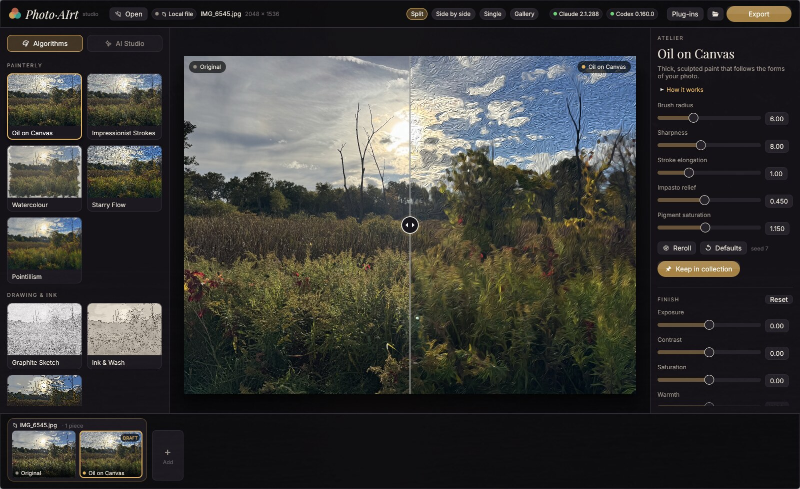
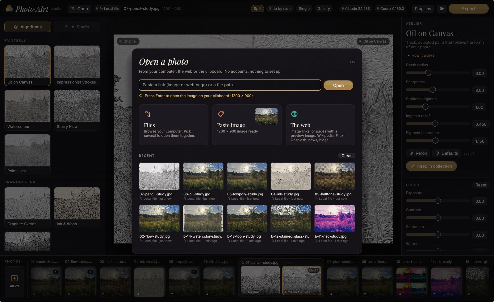
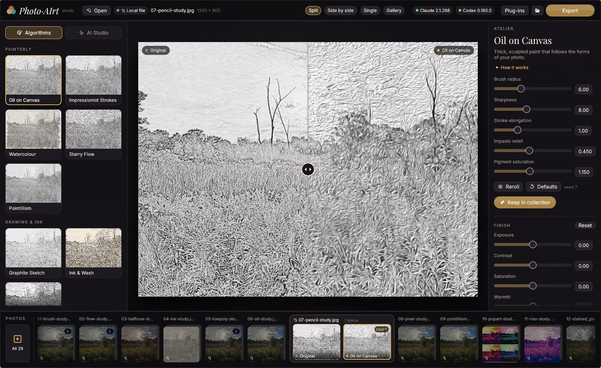
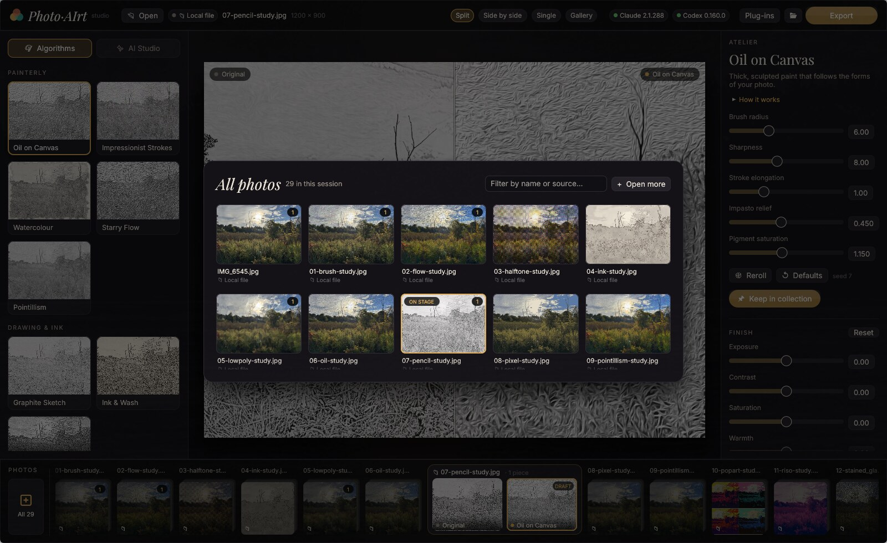
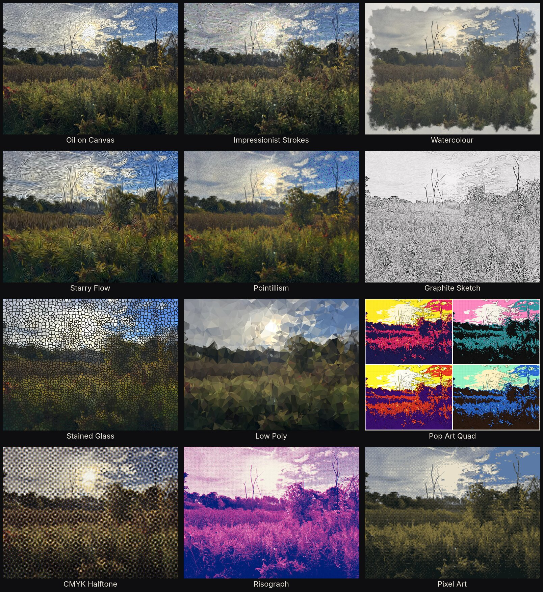
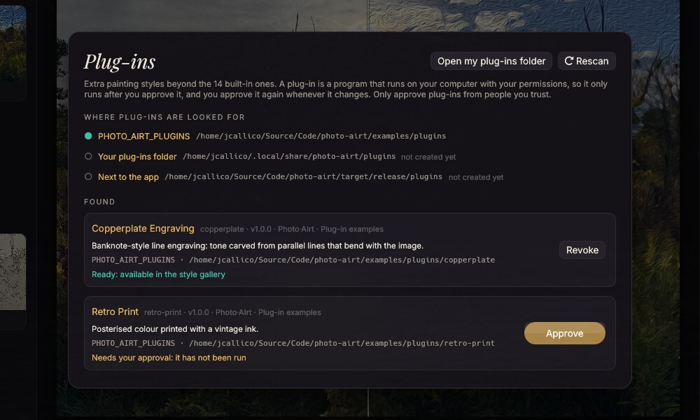
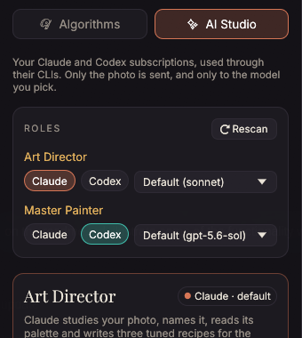
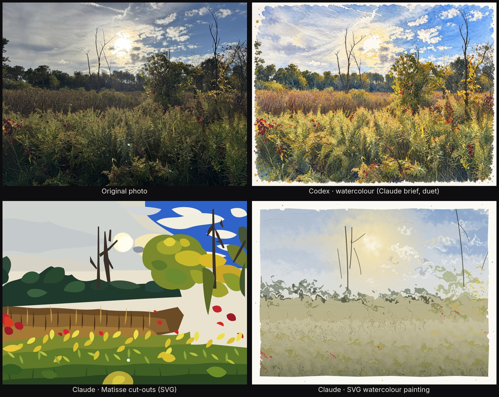
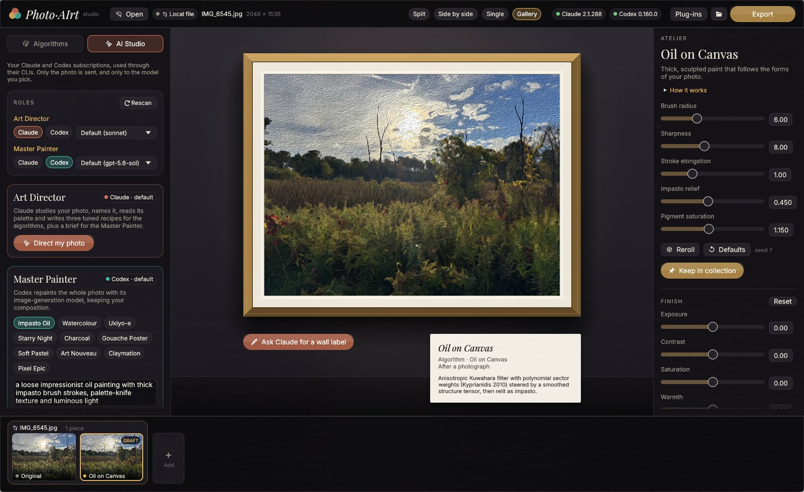

# Photo·AIrt

Photo·AIrt is a native Rust desktop studio for turning your photographs into
art. It combines hand-written image algorithms with AI, using the
**Claude Code** and **Codex** CLIs you are already logged into. There are no
API keys: each AI feature appears only when its CLI is found on `PATH`.



## Getting started

Download the executable archive for your OS from
[GitHub Releases](https://github.com/JCallico/photo-airt/releases), extract it,
and run `photo-airt` (`photo-airt.exe` on Windows). Linux and Windows downloads
are for x64; macOS has separate Apple Silicon and Intel downloads. The
prebuilt executable does not need Rust.

To build from source:

You need a Rust toolchain (pinned in `mise.toml`, or any recent stable Rust).
The AI features also need either or both of
[Claude Code](https://claude.com/claude-code) and
[Codex CLI](https://github.com/openai/codex), installed and logged in.

```bash
git clone https://github.com/JCallico/photo-airt.git
cd photo-airt
cargo run --release -- path/to/photo.jpg   # a path or a link; or start empty and press Ctrl+O
```

Local paths may be absolute or relative to the current directory. An existing
local file takes precedence over a bare website address; prefix a relative
path with `./` (or `.\` on Windows) to identify it as a file even if it is
missing. Explicit `https://` links always open from the web.

On Linux, the native file dialog uses the XDG desktop portal. HEIC files are
decoded through ImageMagick, libvips or `heif-convert` when one of them is
installed.

## Open photos from anywhere

Photos can come from your computer, the web or the clipboard. There are no
accounts and nothing to set up. Press `Ctrl+O` (or **Open**) for the
**Open a photo** sheet, which has three parts.



**The smart input bar** understands whatever you type or paste, and tells you
live what it found:

* a file path (`/…`, `~/…`, `file://…`);
* an image link;
* a web page link, such as a Wikipedia article, a news story or a Flickr or
  Unsplash page. The app opens the page's preview image (`og:image`,
  `twitter:image`).

If the clipboard holds a link, the bar offers it straight away.

**The source tiles** are Files, Clipboard and The web. **Files** opens the file
dialog and lets you pick several photos at once. **Clipboard** shows a live
preview of a copied image; with the input bar empty, `Enter` pastes it. **The
web** takes you to the input bar.

**Recents** show thumbnails of your last photos, including web ones (served
from a local cache), and work across launches.

You can also skip the sheet:

* **`Ctrl+V`** anywhere in the studio opens a copied link or path immediately,
  or several of them, one per line.
* **Drop** one or more files on the window.
* **Start with a link:** `photo-airt https://…`.

The top bar shows where the photo came from (📁 local file, 🌐 website,
📋 clipboard). Gallery wall labels credit the source, for example "After a
photograph from en.wikipedia.org".

### The collection bar

Every photo you open in a session joins the **collection bar** at the bottom
of the window. There is one row for everything:

* **The photo on stage is expanded** in a framed group: its original, its
  artworks and any AI jobs still painting.
* **Every other photo is a compact stack.** Its artworks are folded away
  behind it, a badge counts them, and a pulsing dot shows that an AI job is
  working on it.

Click a stack, or press `[` / `]`, and it expands in place while the previous
photo folds into a stack. Each photo keeps its own studio state: artworks,
art direction and style previews. Returning to a photo is instant, and quick
navigation skips ahead without waiting for every photo to load.

AI jobs belong to the photo they were started for. If you switch photos while
Codex is painting, the result is delivered to the right photo's stack.



The bar scrolls and keeps the photo on stage centred. Once two or more
photos are open, an **All photos** tile is pinned at the left end of the bar,
so it stays visible however far you scroll (or press `P`). It opens a contact
sheet of every photo, with a filter by name or source, artwork counts, and a remove button
on hover. Paste several links or paths at once (one per line) to open them
all together.



### Downloading safely

Links are fetched conservatively:

* **https only;**
* a **64 MB size limit**, plus connect and overall timeouts;
* at most 5 redirects;
* **downloads must *sniff* as an image**. File extensions and the server's
  stated content type are never trusted;
* decoding has memory and pixel limits, which protect against images crafted
  to exhaust memory;
* the external HEIC/AVIF converters are only used for files whose content
  identifies them as those formats.

Downloaded and pasted photos are cached in `~/.cache/photo-airt/sources`.
Cached copies that are no longer among your recents are cleaned up
automatically.

## Fourteen algorithmic styles

Every style is written from scratch in Rust and runs on all cores with rayon.
The cards in the style gallery show live previews of *your* photo. Selecting
one renders it at working resolution in a second or two. A paint-sweep
animation reveals each new result.



| Style | Technique |
|---|---|
| Oil on Canvas | Anisotropic Kuwahara filter with polynomial sector weights, structure-tensor flow, impasto relighting |
| Impressionist Strokes | Hertzmann multi-layer curved brush strokes, bristle texture, height-map relief (painted in parallel bands, stroke order preserved) |
| Watercolour | Abstraction, wet-in-wet bleeding, Bousseau pigment-density model, granulation, XDoG underdrawing, deckled border and splatter |
| Starry Flow | Line integral convolution of colour-jittered stroke noise along a smoothed tangent field |
| Pointillism | Jittered dot placement, divisionist hue splitting, a detail pass |
| Graphite Sketch, Ink & Wash, Cel Animation | Colour dodge with LIC hatching, XDoG, soft value quantisation |
| Stained Glass, Low Poly, Pop Art Quad | Jump-flood Voronoi with chamfer-distance lead lines, Delaunay facets, posterised palettes |
| CMYK Halftone, Risograph, Pixel Art | Rotated AM screens, least-squares two-ink separation, k-means++ palette with Bayer dithering |

Each style's settings appear as controls in the **Atelier** panel. Every
artwork, including AI results, also gets a non-destructive **Finish** layer:
exposure, contrast, saturation, warmth, vignette, grain, canvas weave and
glow.

## Plug-in styles

Add your own painting styles with **plug-ins**: small programs in any
language. A plug-in's `plugin.toml` describes it (name, gallery group,
description and settings), and Photo·AIrt turns its settings into sliders,
toggles and drop-downs in the Atelier panel. Plug-in styles get live
previews, the finish layer, export and Art Director recipes, just like the
built-in ones. The 14 built-in styles use the same plug-in interface, compiled
into the single executable, so the app works out of the box with nothing to
install. Each one lives in its own folder under [`plugins/`](plugins), laid
out like an external plug-in. Build its executable into the folder, move the
folder to a plug-ins location, and it loads as an external plug-in.



- **Where plug-ins live:** a plug-in is a folder with a `plugin.toml`. The app
  looks in folders listed in `PHOTO_AIRT_PLUGINS`, then your plug-ins folder
  (for example `~/.local/share/photo-airt/plugins/` on Linux), then a
  `plugins/` folder next to the executable.
- **Approval:** a plug-in is a program that runs with your permissions, so it
  never runs until you approve it in the **Plug-ins** panel. The approval is
  pinned to a checksum of the plug-in's files, so any change needs approving
  again.
- **How rendering works:** each render is one short-lived process. The app
  writes `input.png` and `request.json` to a temporary folder, the plug-in
  writes `output.png`, and progress and errors arrive as JSON lines.
- **For authors:** see [docs/plugins.md](docs/plugins.md) for the full
  contract and requirements. Two complete examples, each using only its
  standard library, live in [`examples/plugins`](examples/plugins):
  - **Retro Print** (Python) shows all three setting types.
  - **Copperplate Engraving** (Node.js) adds a style the app doesn't have:
    banknote-style line engraving that uses `scale` and `seed`.

  To load them in the app from a checkout:
  `PHOTO_AIRT_PLUGINS=examples/plugins cargo run --release`, then approve
  them in the Plug-ins panel.

## AI studio: Art Director and Master Painter

AI work is split into two roles. Each role can be assigned to either CLI and
gets its own model.



| Role | Claude | Codex |
|---|---|---|
| **Art Director**: art direction, briefs, vector art, wall labels | ✓ | ✓ (vision through `--image`, read-only sandbox) |
| **Master Painter**: repaints the whole photo | ✓ as an **SVG painting** (Claude Code has no raster image model) | ✓ raster, via its `image_generation` tool |

Roles are resolved from what is installed when the app starts. The
**Rescan** button runs detection again. Detection covers:

* whether each CLI is on `PATH`;
* whether Codex has `image_generation`;
* which models each CLI offers. Codex's list comes from
  `~/.codex/models_cache.json` and its default from `~/.codex/config.toml`.
  Claude gets the aliases `opus`, `sonnet`, `haiku` and `fable`, plus its
  default from `~/.claude/settings.json`.

Saved choices are kept when they are still valid. Otherwise the app falls
back to Claude as Art Director and Codex as Master Painter, whichever exists.

If a model fails with an account or model error, the picker flags it with ⚠
and the reason. An example is "Fable 5.1 requires usage credits". The flag
clears the next time that model succeeds. Role choices and model health are
stored in `~/.config/photo-airt/prefs.json`.

<br clear="right">

What each AI feature does:

* **Art Director:** reads the photo and returns a title, a palette, three
  tuned recipes for the algorithms (one click to apply), and a brief for the
  Master Painter.
* **Master Painter:** repaints from ten presets or your own brief. In *Duet*
  mode, the Art Director first writes a photo-specific prompt for the Master
  Painter.
* **Vector Reinterpretation:** the Art Director hand-writes an SVG (Matisse
  cut-outs, Cubist, Bauhaus, woodblock and others), which is rasterised with
  resvg.
* **Wall labels:** museum placards for the Gallery view.



AI results are saved to `~/Pictures/Photo-AIrt`. Job scratch files go to
`~/.cache/photo-airt/jobs`. A live studio log streams each CLI's progress,
and running jobs appear in the filmstrip. A Codex repaint usually takes 1–2
minutes, and a Claude SVG takes 1–3.

## Gallery view

The Gallery view hangs the selected artwork in a gilded frame on a lit wall.
The wall label comes from the Art Director, or falls back to the technique.



## Using the studio

Views switch with keys `1`–`4`:

* **Split:** a draggable before/after compare with zoom (scroll) and pan
  (drag).
* **Side by side.**
* **Single.**
* **Gallery.**

The collection bar holds each photo's artworks. A new render replaces the current
*draft*. Keep a draft with `K` and it becomes a permanent piece. **Export**
(`Ctrl+S`) re-renders algorithmic pieces at the photo's full resolution and
saves them to `~/Pictures/Photo-AIrt`.

| Key | Action |
|---|---|
| `Space` (hold) | Show the original |
| `1`–`4` | Switch view |
| `←` / `→` | Browse the collection |
| `[` / `]` | Previous / next photo |
| `P` | All photos (contact sheet) |
| `K` / `R` | Keep the draft / reroll the seed |
| `A` | Switch between Algorithms and AI Studio |
| `Ctrl+O` / `Ctrl+S` | Open a photo / export |
| `Ctrl+V` | Open a copied link or file path |

## Command line

```bash
photo-airt https://en.wikipedia.org/wiki/The_Starry_Night       # open a link (or a path) in the studio
photo-airt --render <style-id|all> in.jpg out_dir [long-side]   # batch-render styles
PHOTO_AIRT_DIRECTOR=codex:gpt-5.6-luna PHOTO_AIRT_PAINTER=claude:sonnet \
  photo-airt --ai <director|vector|repaint|duet|placard> in.jpg [out.png]   # run one AI job
```

Every input above can be a path or a link.

Plug-in tools:

```bash
photo-airt --plugins                                # where plug-ins are looked for, and what was found
photo-airt --check-plugin path/to/my-plugin         # validate a plug-in against the contract
photo-airt --run-plugin oil render request.json     # render a built-in style through the plug-in contract
```

## Development

```bash
cargo test --release --workspace
cargo clippy --release --workspace --all-targets -- -D warnings
cargo fmt --all --check
RUSTDOCFLAGS="-D warnings" cargo doc --no-deps --workspace
cargo deny check   # advisories, licenses, bans, sources (deny.toml)
```

CI runs these checks on every pull request:

- lint (rustfmt, clippy, rustdoc and whitespace);
- build and tests on Linux, macOS and Windows, including the example
  plug-ins and every built-in style run as an external plug-in;
- the `cargo-deny` policy;
- GitHub dependency review.

The `cargo-deny` policy also runs weekly, so new RustSec advisories surface
even when the code hasn't changed.

Planned features are tracked in [BACKLOG.md](BACKLOG.md).
Release builds, downloads and publication are documented in
[docs/releases.md](docs/releases.md).
Changes to `main` go through pull requests, and the same checks run in CI.
Contributor and agent guidelines are in [AGENTS.md](AGENTS.md). To report a
security issue, follow [SECURITY.md](SECURITY.md).

## License

[MIT](LICENSE) © 2026 Javier Callico. The bundled Inter and Playfair Display
fonts are licensed under the SIL Open Font License 1.1 (`assets/fonts/`).
